# Install Argo cd

```
helm repo add argo https://argoproj.github.io/argo-helm
```

```
helm install my-argo-cd argo/argo-cd --version 4.6.0 --create-namespace argocd
```


## Getting started


Setup argo integration: After deploying argo chart in the eks cluster get password en execute port forward to continue with the repository configuration

to get the argo console runing in the browser run kubectl port-forward as follows:
```
kubectl port-forward svc/argo-cd-argocd-server  8080:443
```

then go to the browser and open localhost:8080

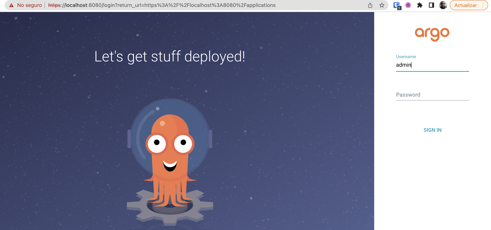

to get the password run 
```
kubectl  get secret argocd-initial-admin-secret -o jsonpath="{.data.password}" | base64 -d
```
## create connection to github in argo

browse to repository option in argo console


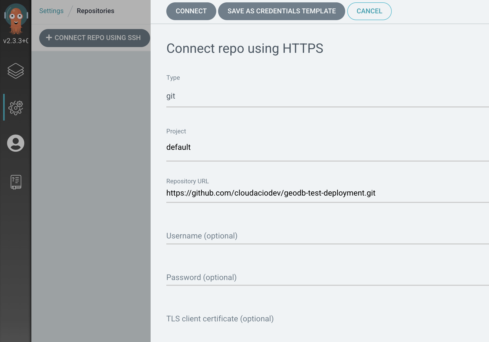


now create the application to deploy the helm chart

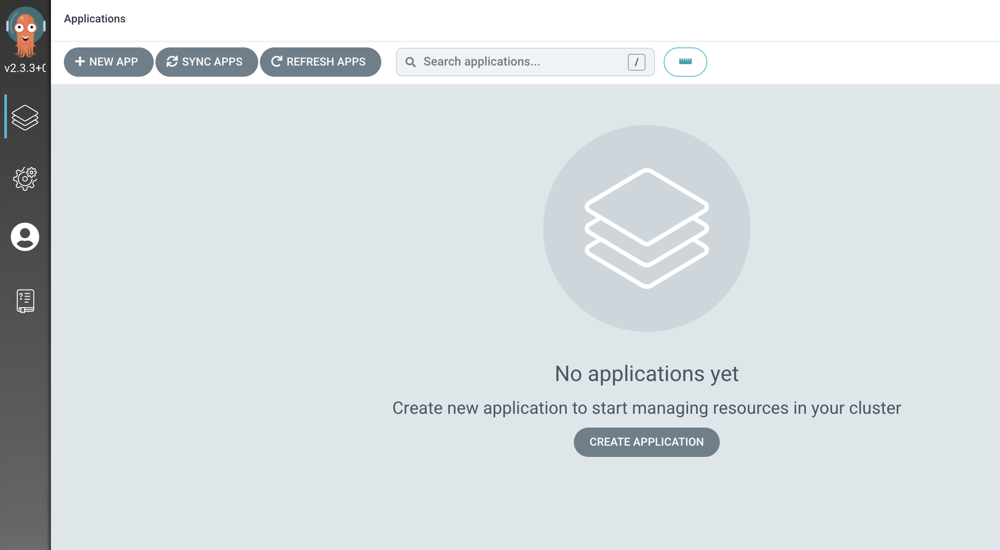
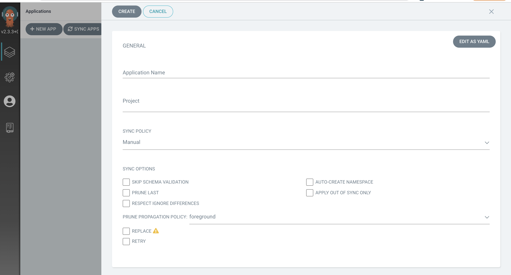
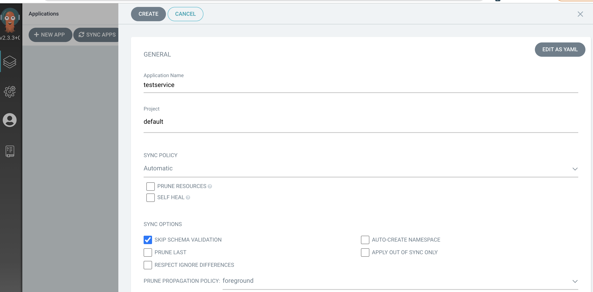
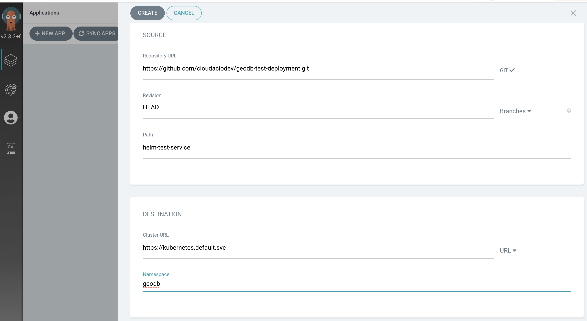

once you create the application you will see the application status in the dashboard

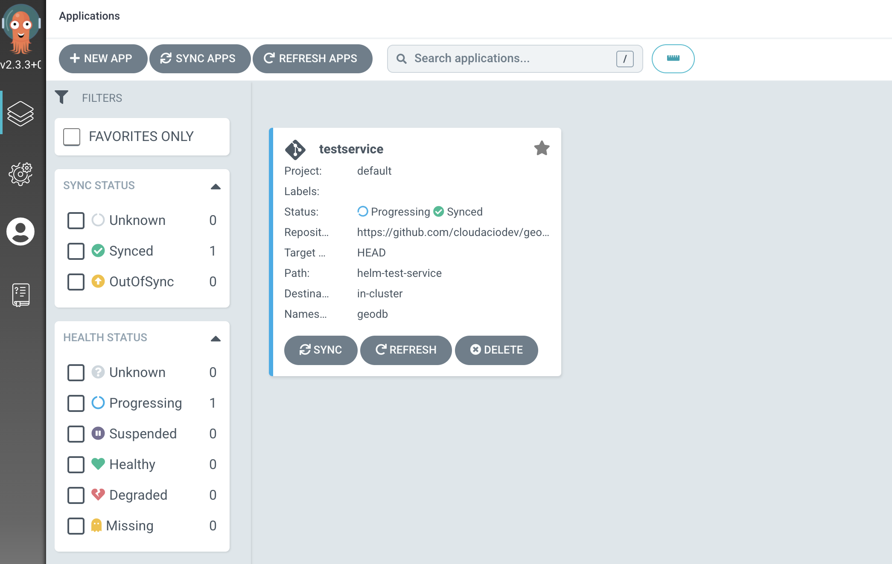

## open the application

get the load balancer url  by runing 

```
kubectl get service app -n geodb
```
the load balancer url will be in EXTERNAL-IP column

open the app using the load balancer on port 3000

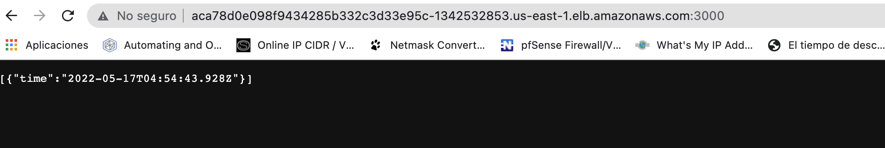

## create Application configurations in ArgoCD

To configure app run:

```
kubectl apply --filename argocd-app-manifest.yaml
```

To configure db run:

```
kubectl apply --filename argocd-db-manifest.yaml

```
## Update Github Token permissions

In the current repository go to settings 

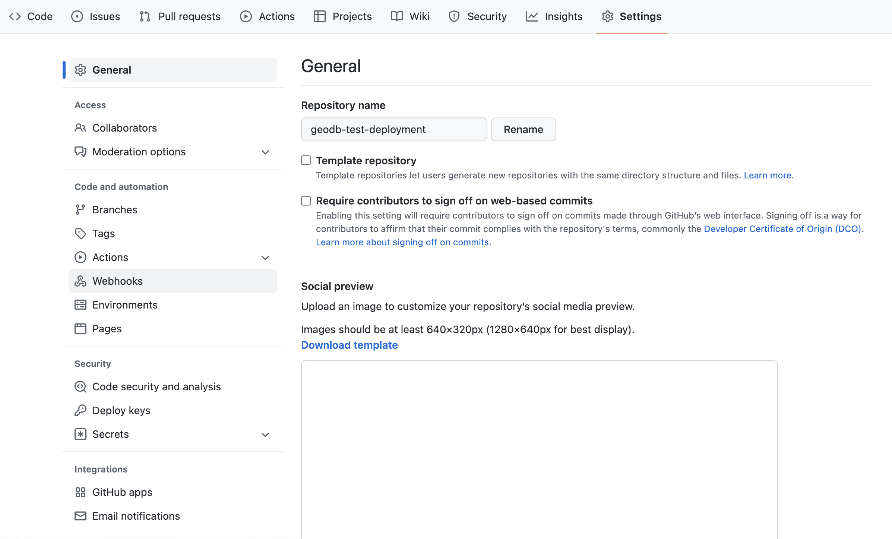

Select actions and give read and wirte permissions

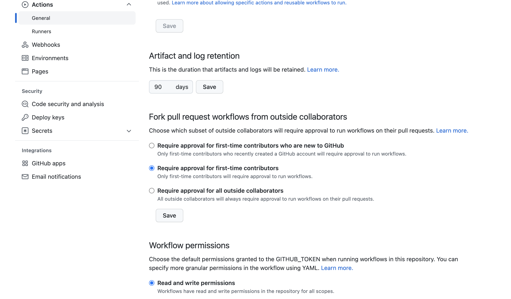

add stage to autocommit in github actions file (geodb-test-deployment/.github/workflows/github-actions-geodb.yml)

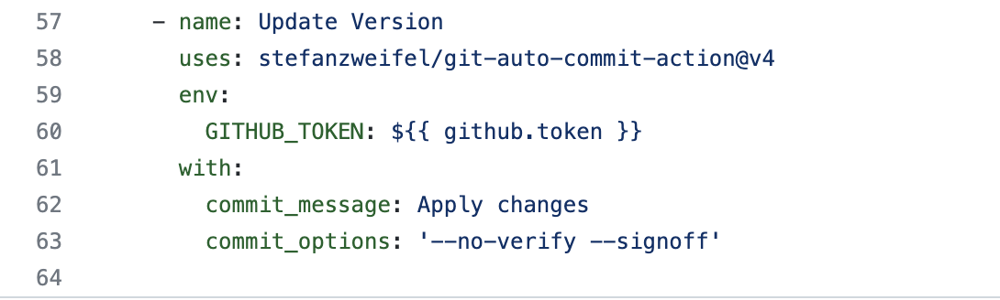


